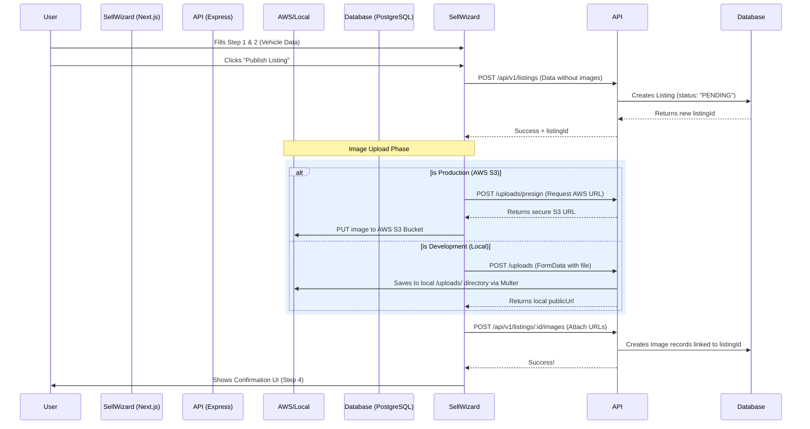
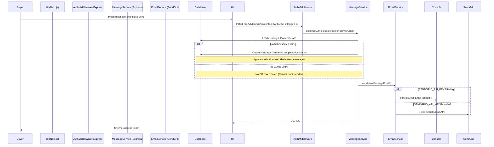
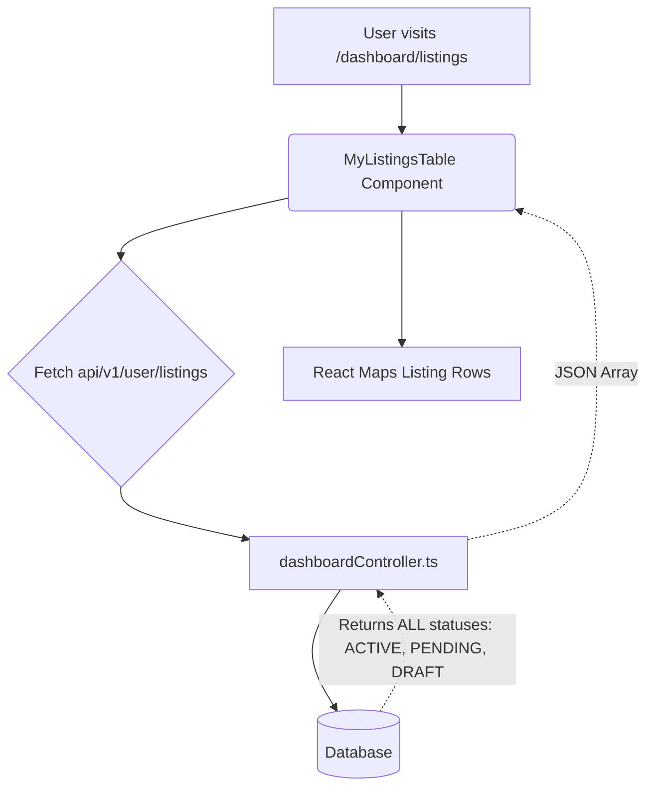
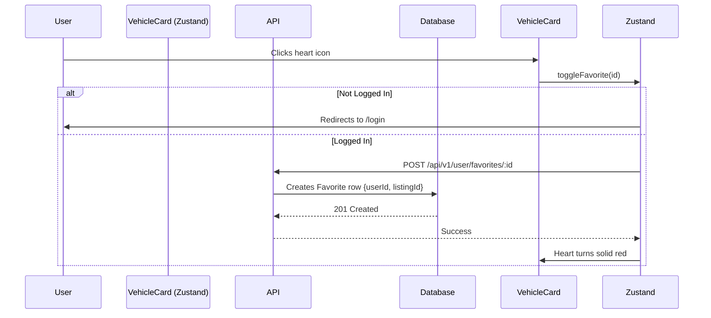

# Kaarplus System Use Cases & Logic Flows

This document outlines the exact, implemented logic flows in the Kaarplus application as of the current build. It details the step-by-step path of data from the frontend UI to the backend Prisma database, including which features are fully functional and which rely on placeholders.

---

## 1. Publishing a Listing (Sell Wizard)

**Scenario:** A user wants to sell their vehicle and fills out the 4-step `/sell` wizard.

### Logic Flow

### Implementation Status
> [!NOTE]
> **Fully Implemented**: Validation (Zod), Authentication protection throughout the wizard, the duplicate ID collision avoidance mechanism, and dual-environment uploads (S3 vs local static).
> 
> **Placeholder / Not Implemented**: 
> - **Payment Gateways:** The `Stripe` integration for paid listings is mentioned in architecture but not currently enforced in the creation pipeline.
> - **Immediate Active State:** Listings default to `PENDING` waiting for admin approval, but the Admin Gateway to trigger this approval is rudimentary.

---

## 2. Contacting a Seller (Messaging)

**Scenario:** A buyer views a car at `/listings/:id` and clicks "Contact Seller" to send an inquiry.

### Logic Flow

### Implementation Status
> [!IMPORTANT]
> **Fully Implemented**: `optionalAuth` middleware correctly separates guests from logged-in users. Authenticated messages persist in Prisma under `Message` models for the dashboard.
> 
> **Placeholder / Not Implemented**: 
> - **SendGrid Configuration:** In development, standard emails are just logged to the Node console (`[Email] Email logged`). You must supply `SENDGRID_API_KEY` to actually ping user inboxes.
> - **Real-time WebSockets:** Socket.io is configured in `app.ts`, but the client-side chat UI relies mostly on HTTP polling/refreshes currently.

---

## 3. Dashboard & My Listings

**Scenario:** A seller visits `/dashboard/listings` to see their posted cars.

### Logic Flow

### Implementation Status
> [!NOTE]
> **Fully Implemented**: The dashboard leverages the correct authenticated route `dashboardService.getUserListings` which bypasses the public visibility blocks, ensuring authors see their `PENDING` cars.
> 
> **Placeholder / Not Implemented**: 
> - **Admin Approval Pipeline**: While sellers can see their `PENDING` items, the formal UI for an Admin to click "Approve" (flipping the status to `ACTIVE`) isn't widely visible, requiring raw API calls or manual DB edits to launch a car publicly.

---

## 4. Favorites System

**Scenario:** A user clicks the Heart icon on a car card on the homepage.

### Logic Flow

### Implementation Status
> [!TIP]
> **Fully Implemented**: The global `Zustand` store accurately manages client-state, while the backend protects dead favorites. The favorite state is pre-calculated via SSR when navigating to `/dashboard/favorites`.

---

## 5. Security and Quality Checks

1. **Authentication:** The `requireAuth` and `optionalAuth` pipelines using JWT algorithms are fully robust.
2. **Translation (i18n):** Multi-language structures are strictly mapped to `react-i18next` interpolations (`{{variable}}`), preventing UI key leakage.
3. **Data Integrity:** Forms enforce Zod schema compliance prior to ever hitting the backend.

### What needs to be built next? (Roadmap)
- [ ] Connect the **Stripe Account** to enforce paid VIP listing tiers.
- [ ] Finalize the **Admin Dashboard** (`/admin`) for 1-click `PENDING` to `ACTIVE` vehicle approvals.
- [ ] Link genuine SendGrid keys to escape the `console.log` email sandbox.
- [ ] Ensure the **Socket.io** event emitters broadcast new messages directly to the chat bubbles without requiring a page reload.
